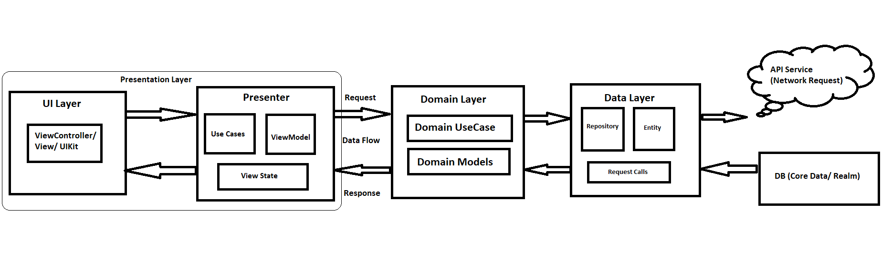

# Marvel
Marvel app will show all the marvel characters List with details in brief.

We have XcodeGen Framework to add the dependencies which can me modified using yml. following are the dependencies added: 
* Kingfisher (7.0.0):  For caching and loading the images we have used this framework.
* JSONDecoder-Keypath (0.1.0): To Decode the object at some custom key path that can be easily done by this framwork.

## Architecture:
This Project uses the architecture  MVVM with clean architecture which is very loosely coupled and easy to test Following are the layer used in this architecture.  

- Data
- Domain
- Presentation

### Data Layer: This layer is having responsibility to deal with all the request calls, data parsing, network error handing etc. 
Request calls are established using providers and each module have a single provider with all the submodule request calls. Each provider will give the request call to the network layer which will fetch the response and validate it and give back it to provider.

### Domain Layer: This layer is the intermediator b/w presentation layer and data layer which establish the communication using contracts. 
Contracts are the set of methods or set of rule which are implemented by the data and presentation layer to communicate using domain layer.

### Presentation layer: This layer is responsible to perform all the UI related operations. This layer contain all the UI logic. Data binding takes place between presenter and view controller.

## Unit testing 
 For Unit testing, application uses the native framework which is XCTest framework and testing for all the three layers have been performed with respected mock data is crated.
